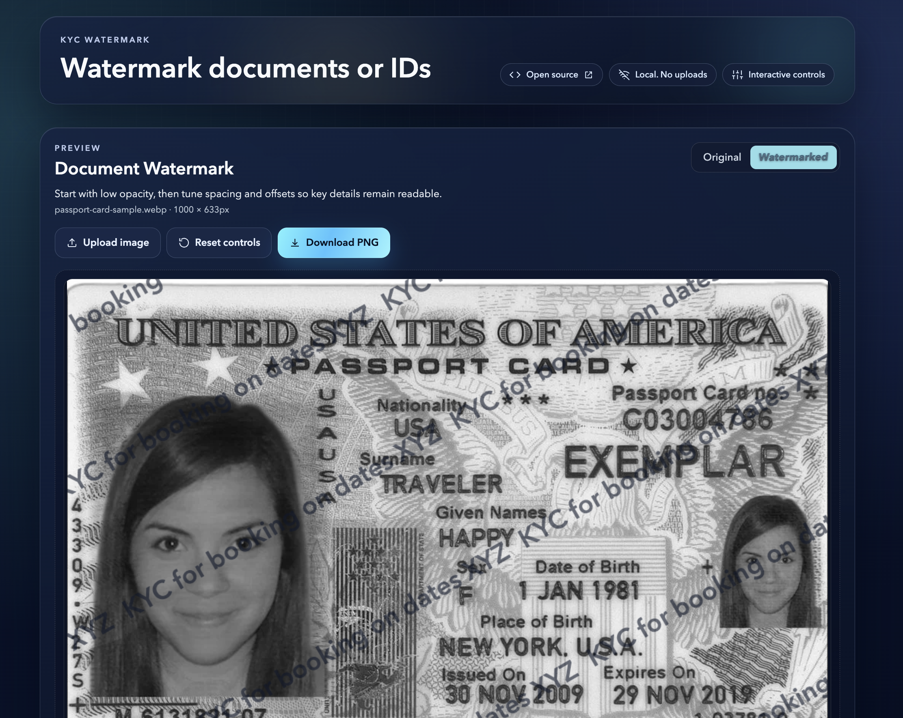

# KYCWatermark.com

An offline-first web app for adding purpose-specific watermarks to ID and document images directly in the browser.

## Screenshot



## Why

When sharing identity documents for KYC, a visible watermark helps reduce misuse by making it clear the image was shared for a specific purpose. This project exists to provide a quick, private, and customizable way to do that without uploading files to a server.

## Run Locally

### Prerequisites

- Node.js 20+
- pnpm 10+

### Clone the repository

```bash
git clone <your-repository-url>
cd <your-repository-folder>
```

### Setup

```bash
pnpm install
```

### Start the development server

```bash
pnpm dev
```

Open `http://localhost:5173` in your browser.

### Production build and preview

```bash
pnpm build
pnpm preview
```

### Type check

```bash
pnpm lint
```

## Tech Stack

- React 19
- TypeScript
- Vite 7
- Tailwind CSS 4
- Cloudflare Pages (via Wrangler)
